# fullstack-k8s-deployment

A full-stack Customer Management System containerized with Docker and deployed on Kubernetes through a fully automated CI/CD pipeline, with a focus on DevOps infrastructure, automation, and observability.

## Stack

**Frontend** — Angular, TypeScript, Nginx  
**Backend** — Spring Boot, Java
**Database** — MySQL  
**Containerization** — Docker, DockerHub  
**Orchestration** — Kubernetes, Nginx Ingress  
**CI/CD** — Jenkins  
**Automation** — Ansible  
**Code Quality** — SonarQube  
**Artifact Management** — Nexus  
**Monitoring** — Prometheus, Grafana  

## Pipeline

Each push triggers a Jenkins pipeline that runs end to end without manual intervention.

```
Build & Test → SonarQube → Nexus → Docker Build & Push → Deploy to K8s → Email Report
```

Frontend and backend are built in parallel. The pipeline aborts if the SonarQube quality gate fails. A detailed HTML report is emailed after every run.

## Kubernetes

All resources run in the `fullstack` namespace on a 3-node AWS cluster. The frontend, backend, and MySQL containers were scheduled and started on worker01 with zero restarts. Nginx Ingress routes `/api/*` to the backend and `/*` to the frontend, with `fullstack.com` mapped to the cluster master's public IP via a local DNS override.


## Good Practices

- **Persistent Storage** — MySQL is configured with a PersistentVolume and PersistentVolumeClaim to ensure data durability across pod restarts and rescheduling.
- **Secrets Management** — Kubernetes Secrets are used for all sensitive credentials including MySQL root password, database user, and backend DB connection, keeping them out of the codebase.
- **Parallel Execution** — Frontend and backend build and test stages run in parallel within the Jenkins pipeline, reducing total pipeline time.
- **Quality Gate Enforcement** — SonarQube acts as a hard blocker in the pipeline. If either the frontend or backend fails the quality gate, the pipeline aborts immediately before any artifact is published or deployed.
- **Image Visibility** — The frontend image is publicly available on DockerHub since it is served to end users. The backend image is kept private to prevent exposing application internals, dependency versions, and API structure that could be leveraged to identify vulnerabilities.
- **Namespace Isolation** — All workloads run inside a dedicated `fullstack` namespace, cleanly separated from system and monitoring namespaces on the same cluster.
- **Traceable Deployments** — Docker images are tagged by Jenkins build number, making every deployment fully traceable and allowing precise rollback to any previous build.
- **Pipeline Observability** — An automated HTML email report is sent after every pipeline run detailing the status of each stage, build duration, and logs on failure.
- **Separation of Concerns** — Ansible handles infrastructure automation separately from the Jenkinsfile, keeping pipeline logic clean and playbooks independently reusable.
- **Automated Rollout Verification** — The deployment stage waits for Kubernetes rollout status before marking the pipeline as successful, ensuring the application is actually running before the pipeline completes.


## Results

### All 8 pipeline stages completed successfully in under 6 minutes, with an automated HTML report delivered upon completion
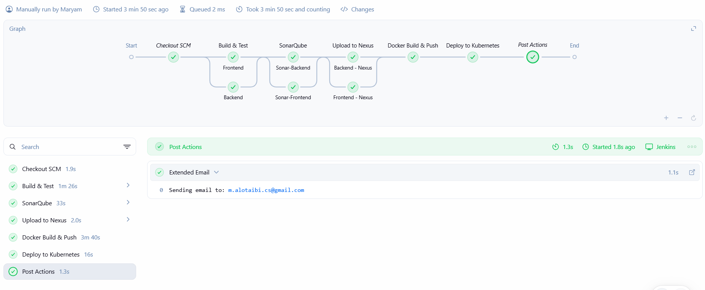

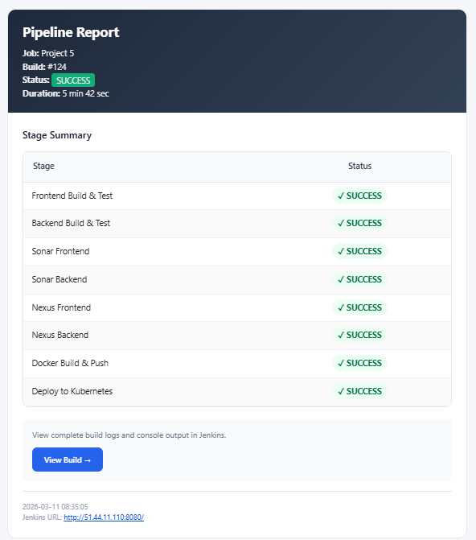

### All three pods — frontend, backend, and MySQL — are running with zero restarts across the cluster
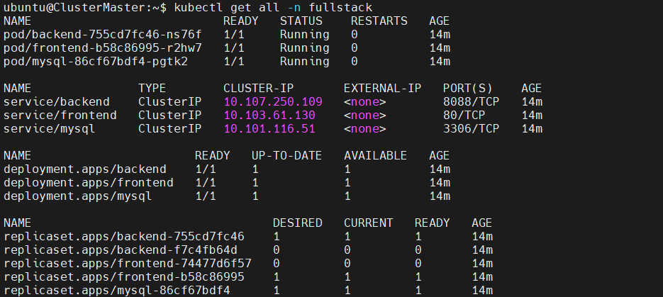

### All three containers were successfully scheduled and started on worker01. The backend and frontend images were pulled from DockerHub in under 4 seconds, while the MySQL image was already cached on the node
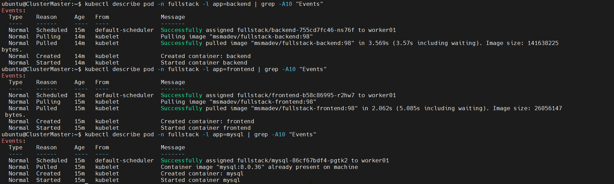

### The application is live and fully accessible through the Nginx Ingress, with the REST API serving data correctly
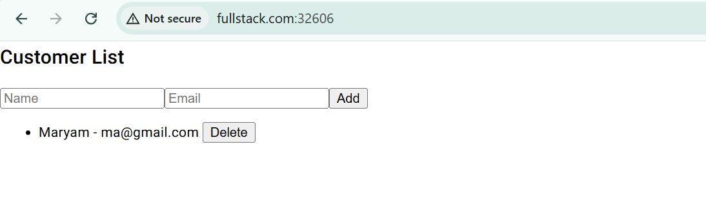

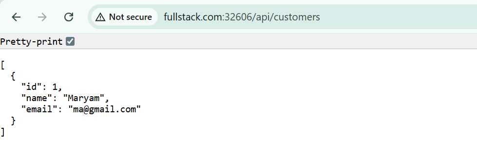

### Customer records are correctly persisted in MySQL using a PersistentVolume
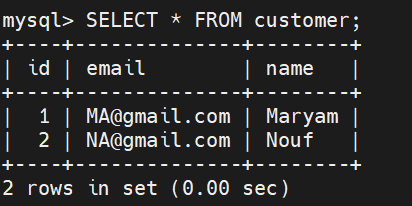

### Both projects passed the SonarQube quality gate with zero bugs and zero vulnerabilities
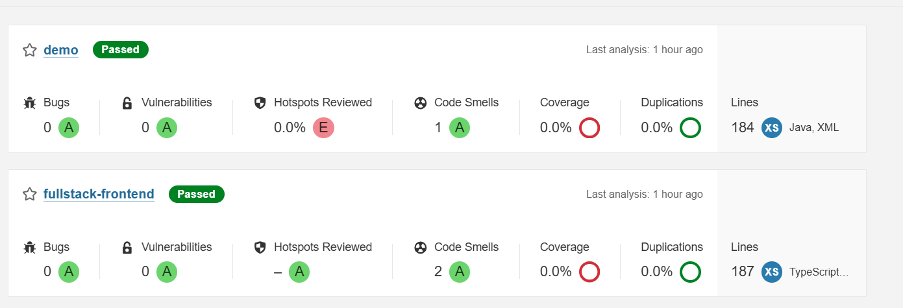

### Docker images were successfully built and pushed to DockerHub
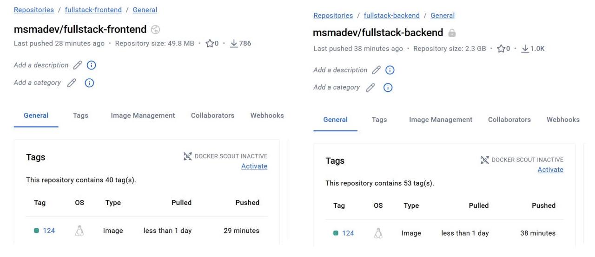

### Build artifacts are versioned and stored in Nexus, with the backend JAR and frontend TGZ published under the com.devops group
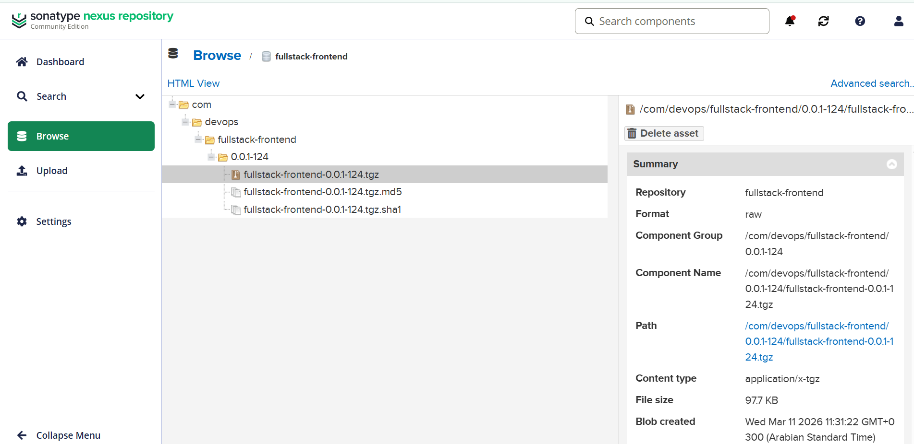

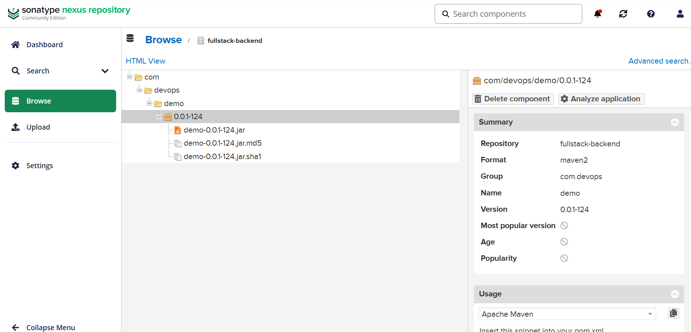

### The Kubernetes cluster is monitored in real time via Grafana, tracking CPU, memory, pod count, and namespace resource usage across all nodes
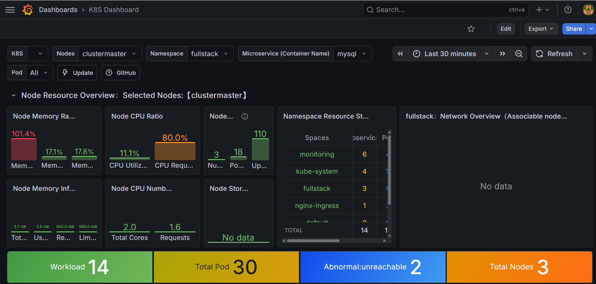

*Maryam Alotaibi · GTA DevOps Training Bootcamp · March 2026*
